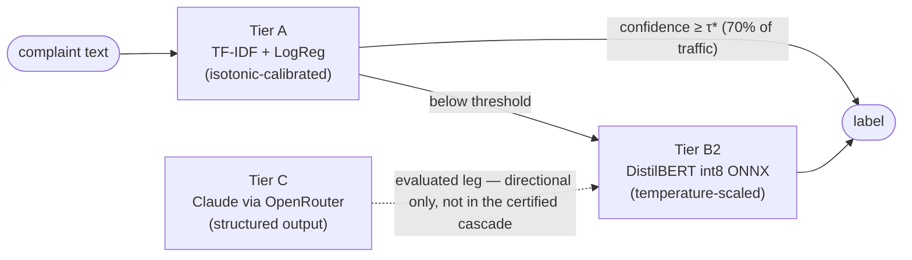

# Triage Router Lab

**Before you pay for an LLM, know your frontier.**

A three-tier consumer-complaint triage system — TF-IDF linear models (Tier A), fine-tuned transformers (Tier B), Claude LLMs (Tier C) — combined into a confidence-cascade router, optimized against an explicit business cost model, and stress-tested on eleven years of measured distribution drift in the CFPB Consumer Complaint Database (2015→2026).

### ▶ [Live demo — luciszhang.github.io/triage-router](https://luciszhang.github.io/triage-router/)

Fully static: precomputed results plus in-browser int8 ONNX inference (the actual deployment model runs in your tab). Every number on the site is test-gated to a committed run record. The **case study narrative** is the final panel of the demo.

---

## Headline numbers

Final runs on the frozen TEST-IID slice (n=104,443, zero-shot for Tier C). Every headline carries a 95% bootstrap CI (n=1,000, fixed seed); every number below is quoted verbatim from committed artifacts (`results/runs.jsonl`, `results/frontier/`, [EXPERIMENT_LOG.md](EXPERIMENT_LOG.md)), and every row lists the command that reproduces it.

| Point | TEST-IID macro-F1 [95% CI] | Measured cost / latency | Reproduce |
|---|---|---|---|
| **Tier A** — TF-IDF + calibrated LogReg | 0.7605 [0.7564, 0.7643] | ≈ free, CPU | `uv run python -m triage_lab.harness configs/tier_a_logreg_test_iid.yaml` |
| **Tier B1** — ModernBERT-base × 3 seeds | 0.7878 / 0.7878 / 0.7863 | GPU fine-tune | `uv run python -m triage_lab.harness configs/tier_b1_modernbert_sa.yaml` (and `_sb`, `_sc`) |
| **Tier B2** — DistilBERT, deployment point | **0.7950 [0.7909, 0.7988]** | int8 ONNX, runs in-browser | `uv run python -m triage_lab.harness configs/tier_b2_distilbert_s0.yaml` |
| **Tier C** — Claude Haiku 4.5 | 0.7697 [0.7499, 0.7886] | $1.315/1k · p50 1.38 s | `uv run --extra tierc python -m triage_lab.harness configs/tier_c_haiku_zeroshot_test_iid.yaml` |
| **Tier C** — Claude Sonnet 5 (subsample) | 0.7418 [0.7015, 0.7730] | $3.659/1k · p50 3.17 s | `uv run --extra tierc python -m triage_lab.harness configs/tier_c_sonnet_zeroshot_test_iid.yaml` |
| **Router** — A→B2 confidence cascade | **+0.0370 [+0.0337, +0.0402]** vs Tier A | **−$120.58/1k [−131.04, −110.24]** vs all-linear policy | `make frontier` |

Two results worth the click:

- **The certified router claim** (paired bootstrap, n=104,443): *"At significantly LOWER cost than the all-linear policy (paired cost delta $-120.58/1k [-131.04, -110.24]), the a_to_b router raises system macro-F1 by +0.0370 [0.0337, 0.0402]."* Both intervals exclude zero.
- **The pre-registered surprise:** under the frozen training protocol, the 66M-parameter DistilBERT beats all three ModernBERT-base seeds (per-seed paired deltas −0.0072 to −0.0088, every CI excluding zero, McNemar p ≤ 6.3e-08). The deployment model *is* the accuracy headline — a protocol-scoped claim, logged as such.

**External forged-tier scenario (CAL only; not a new headline).** A hash-pinned handoff
from `frontier-forge` adds its R1b native-MTP service point as a hypothetical terminal arm
and re-prices all 512 committed Tier A CAL risk thresholds. Under the point assumption
that R1b's observed 1/20 serving failure rate transfers to this different task, the grid
selects τ=0.8483569229, keeps 32.52% in Tier A, and models **$254.68/1k**. That number is
not certified and is not comparable to the TEST-IID router headline: R1b consumes source
metadata and solves structured action policy rather than narrative-only product
classification, no joint per-row CAL predictions exist, and the within-task 95% Wilson
interval for 1/20 failures alone moves the selected coverage from 3.33% to 73.21%. The
existing A→B2 headline remains unchanged. Reproduce: `make frontier-forge-scenario`; see
[`results/external_tiers/frontier_forge_r1b_cal_scenario.json`](results/external_tiers/frontier_forge_r1b_cal_scenario.json).

## Architecture



The cascade's escalation threshold τ* is derived on the calibration slice only, by minimizing an explicit per-tier business cost model (inference $ + misroute cost); TEST slices are touched exactly once, for the final certified runs. Tier C is fully evaluated as a routing leg — the honest finding is that it doesn't certify (see below), which is itself the point of building the frontier before paying for the LLM.

## The drift finding (2015→2026)

The models were trained on pre-2023 data and evaluated year by year through 2026-H1. Three panels, one story ([`make drift-charts`](Makefile), `make prior-shift`, `make oov`):

1. **The cliff.** Tier A falls 0.7605 → 0.666 macro-F1 by 2026-H1 — a 9.2-point drop. DistilBERT tracks the same shape (0.790 → 0.726). The LLMs degrade far slower: at 2026-H1 it's A 0.666 / B2 0.726 / Haiku 0.728 / Sonnet 0.782, and Sonnet's 2026-H1 point is statistically indistinguishable from its own 2023 point.
2. **The decomposition.** 4.2 of Tier A's 9.2 points are pure class-mix (prior) shift; the single class `credit_reporting` collapses from F1 0.887 to 0.215. The fine-tuned transformer inherits the same Tier-A-shaped wound — roughly half prior shift, half within-class drift (within-class term +0.0336, CI excluding zero; the "B2 behaves like an LLM" hypothesis was tested and **refuted**) — while the LLMs' within-class term is ≈ 0 or negative.
3. **It isn't the vocabulary.** Token-level OOV rises only 0.545% → 0.773% of token mass, and TF-IDF centroid distance *falls* at 2026-H1 (disjoint CIs). Lexical drift is ruled out as the driver; the damage is class-mix and label-boundary movement, not new words.

Where drift is worst is exactly where the expensive model earns its keep: on 2026-H1, Sonnet beats Haiku by +0.054 macro-F1 [+0.036, +0.073], McNemar p ≈ 1e-15 — after being statistically tied with it in-distribution.

## Reproduce

```bash
git clone https://github.com/LucisZhang/triage-router.git
cd triage-router
uv sync --frozen
uv run python -m triage_lab.reproduce_headline --plan
```

`--plan` resolves the entire headline claim chain — 11 runs, derivation graph, 27 gated outputs — with no `data/` present at all. It's what [CI runs on every push](.github/workflows/ci.yml).

The full verification is honest about its cost:

```bash
make reproduce-headline
```

re-derives everything from the frozen CFPB snapshot and took **12 h 53 m** wall-clock end-to-end on an Apple-silicon laptop (46,360 s — the three ModernBERT seed evals dominate; the data + derivation + demo stages are ~9 minutes combined). It costs **$0 in API spend** (no new LLM calls; Tier C artifacts replay from committed records) and finishes with the split byte-identity gate green, all 11 chain artifacts metric-verified at 1e-9, and **27/27 committed demo outputs byte-identical** under SHA-256 gating. It needs the frozen snapshot and the un-gitted Tier B checkpoints — preflight verifies their hashes and fails in ~2 s with the runbook path if they're missing.

## What didn't work (kept on purpose)

The log records failures with the same rigor as wins. Character n-grams did not help Tier A (macro-F1 0.7466 vs word-only's 0.7535 — hypothesis not supported). Few-shot prompting for Tier C showed no significant gain over zero-shot at roughly twice the cost, so every final Tier C run is zero-shot, by logged amendment. Sonnet — the stronger, pricier model — silently fails to answer up to 2.5% of calls under a tight completion budget (every failure `finish_reason: "length"`; Haiku: 0 failures in 10,000 calls), which became a first-class parse-failure arm in the router analysis. The all-LLM routing leg is **NOT ESTABLISHED**: at n=5,000 its cost delta is favorable but the macro-F1 interval spans zero, so it is reported as directional only, never as a claim. And the first threshold derivation (v1) had a calibration-space mismatch that cost 5–16 points of realized coverage on TEST — diagnosed, documented, and fixed in the v2-isocal derivation that all headline claims use.

## Going deeper

- **[Case study](https://luciszhang.github.io/triage-router/)** — the narrative panel of the demo, every figure traceable to a run record
- **[EXPERIMENT_LOG.md](EXPERIMENT_LOG.md)** — dated hypothesis → result → verdict entries, including the refuted ones, with the reproduction command for every portfolio-bound number
- **[UPGRADE_PLAN.md](UPGRADE_PLAN.md)** — scope, metrics, phase acceptance criteria (the project's single source of truth)
- **[STATUS.md](STATUS.md)** — execution state and decision log
- **[results/](results/)** — the append-only JSONL run log: metrics + CIs, git SHA, snapshot hash, config/prompt hash, wall-clock, and cost per record

**Data & measurement notes.** Dataset: CFPB Consumer Complaint Database (US-government work, public domain), frozen by snapshot hash; temporal splits are byte-identically reproducible via `make data`. All Tier C calls go through OpenRouter; costs are actual per-call token usage × published per-MTok prices, never estimates, with the serving provider recorded per call.
